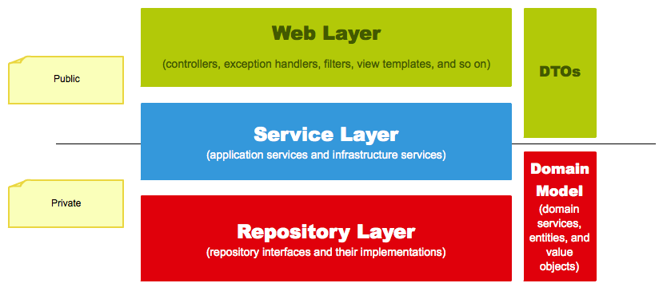

# Web Layer
- @Controller, JSP 등의 뷰 템플릿 영역
- @Filter, @ControllerAdvice 등 외부 **요청과 응답**에 대한 전반적인 영역을 지칭

# Service Layer
- @Service
- Controller / DAO 중간 영역에서 사용됨
- @Transactional이 사용되어야 하는 영역
 
# Repository Layer
- Database와 같이 데이터 저장소에 접근하는 영역 (DAO)
 
# DTOs
- DTO : 계층간에 데이터 교환을 위한 객체

# Domain Model
- **도메인** 이라고 하는 **개발 대상**을 모든 사람이 동일한 관점에서 이해할 수 있고 공유 할 수 있도록 단순화 시킨 것
- @Entity 
